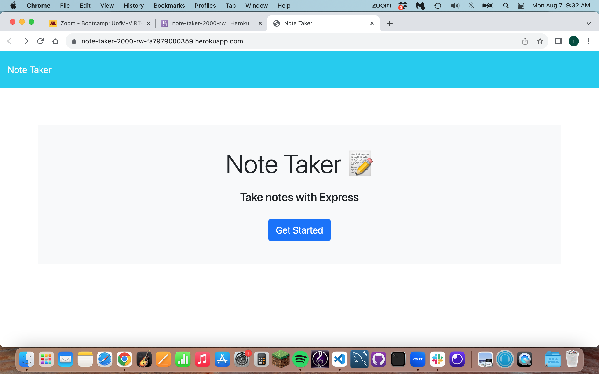

# Note Taker

## Purpose:
- The purpose of creating this application, was to make a website that would help me keep track of things I want to do, and to help keep track of random notes.

## Instructions for Use:
- To use the application, enter a note and title in to the correct fields. 
- When you are ready to save the note, click the save icon on the side of the screen. 
- You can click on the old notes to see what you wrote.
- The delete function is not working quite yet.

## Starter-Code:
- The starter code I was given to work with is in the Develop Copy folder of the project.

## Link to GitHub Repo:
https://github.com/rweisshaar1/note-taker

## Link to Working Website:
https://note-taker-2000-rw-fa7979000359.herokuapp.com/ 

## Screen Shot:

